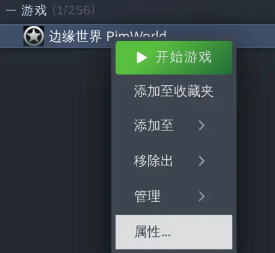
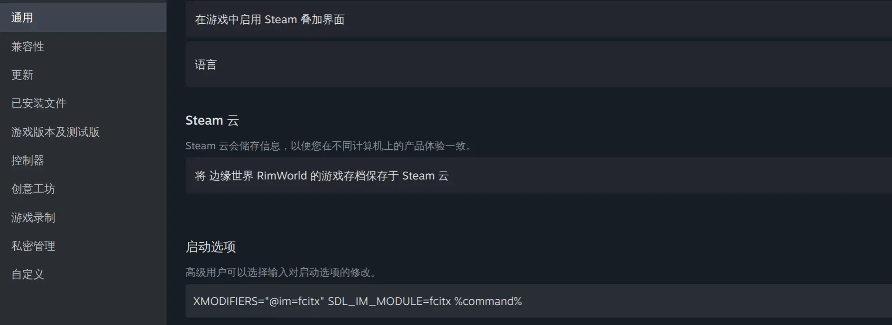

# RimWorld Fcitx 中文输入 Mod

https://github.com/user-attachments/assets/6b7c18dd-a4f0-4537-b2b8-d3a3a54d00eb

> [!CAUTION]
> 1. vibe-coding 产物，使用需谨慎。
> 2. 支持并不完整，存在一些小 bug，通常切换中/英文后即可解决。

为 Linux [fcitx5](https://wiki.archlinux.org/title/Fcitx5) 输入法环境添加中文（及韩文）输入支持。已在 Arch + niri 26.04 + Fcitx5 Rime 环境下验证通过。

## 使用方法

### 1. 安装 libdbus

```sh
sudo apt install libdbus-1-3    # Ubuntu
sudo apt install libdbus-1-3    # Debian
sudo dnf install dbus-libs      # Fedora
sudo pacman -S dbus             # Arch
sudo apk add dbus-libs          # Alpine
sudo zypper install libdbus-1-3 # openSUSE
sudo emerge sys-apps/dbus       # Gentoo
```

出现以下输出即安装成功：
```sh
ldconfig -p | grep libdbus-1.so.3
        libdbus-1.so.3 (libc6,x86-64) => /lib64/libdbus-1.so.3
        libdbus-1.so.3 (libc6) => /lib/libdbus-1.so.3
```

### 2. Steam 中右键 RimWorld > 点击 `属性`



### 3. 在 `启动选项` 中粘贴以下内容



```sh
XMODIFIERS=@im=fcitx SDL_IM_MODULE=fcitx %command%
```

### 4. 在设置中启用 `Fcitx CJK Input` mod

## 工作原理

Unity 2022 会创建 SDL2 fcitx5 输入上下文，但不会把 Linux IME 的提交内容连接到 IMGUI 文本框。本 mod 会做以下事情：

1. 将 `1.6/Assemblies/libfcitxcjkinput.so` 加载进 RimWorld 进程。
2. 监听 RimWorld 的 SDL2 输入上下文对应的 fcitx5 D-Bus 调用、响应与信号。
3. 在 Unity 主线程的 IMGUI 处理过程中排空原生事件队列。
4. 追踪每个输入上下文、事件序列、目标控件与输入法组合锚点。
5. 在保持光标移动的前提下，将文本提交到对应锚点。
6. 在不改变已保存字段值的情况下绘制候选文字与光标。

物理的 IME 切换键仍由 KWin/fcitx5 处理。本 mod 不使用 `/dev/input`、不轮询 fcitx5 状态、不创建临时可执行文件、也不启动单独的辅助进程。

在 **选项 → Mod 设置 → Fcitx CJK Input** 中启用 **Debug log** 可显示诊断叠加层，并将详细诊断日志写入 `/tmp/fcitxcjkinput.log`。

## 构建与安装

```sh
just fmt
just test
just build
just install
```

`just build` 会生成以下文件：

```text
1.6/Assemblies/FcitxCjkInput.dll
1.6/Assemblies/libfcitxcjkinput.so
```

原生库动态链接系统自带的 `libdbus-1.so.3`。

## 许可证

[AGPL-3.0](./LICENSE)
