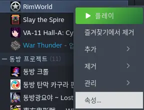
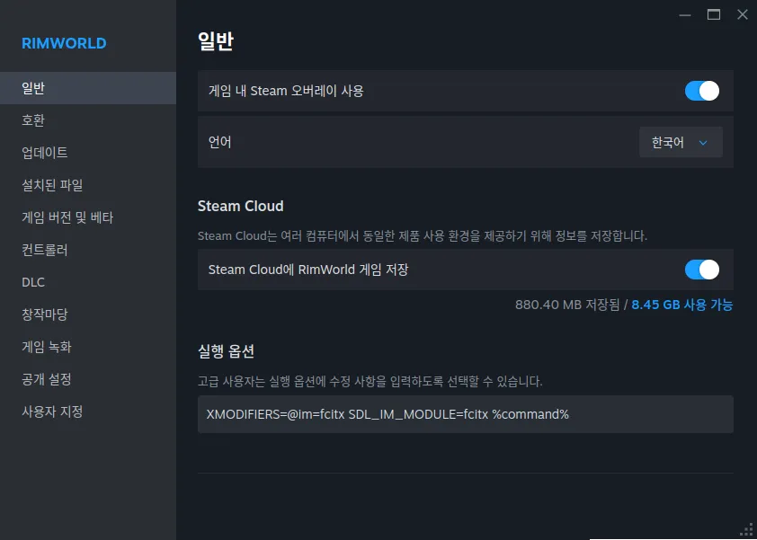

# 림월드 Fcitx 한글 입력 모드

[2026-08-02_21-47-01.webm](https://github.com/user-attachments/assets/a1b7641f-6de8-4f93-a83b-e5b79897f1c6)

> [!CAUTION]
> 1. 바이브 코딩으로 만들어진 모드입니다. 사용에 유의하시기 바랍니다.
> 2. 불완전하게 지원하기 때문에 잔버그가 있습니다. 보통 한영키 변경 시 해결 가능합니다.

리눅스 [fcitx5](https://wiki.archlinux.org/title/Fcitx5) 입력기 환경에서 한글 입력 지원을 추가합니다. fedora 44 + KDE 6.6.4 (wayland) + fcitx5 환경에서 동작을 확인하였습니다.

## 사용 방법

### 1. libdbus 설치

```sh
sudo apt install libdbus-1-3    # Ubuntu
sudo apt install libdbus-1-3    # Debian
sudo dnf install dbus-libs      # Fedora
sudo pacman -S dbus             # Arch
sudo apk add dbus-libs          # Alpine
sudo zypper install libdbus-1-3 # openSUSE
sudo emerge sys-apps/dbus       # Gentoo
```

아래와 같이 나오면 성공입니다:
```sh
ldconfig -p | grep libdbus-1.so.3
        libdbus-1.so.3 (libc6,x86-64) => /lib64/libdbus-1.so.3
        libdbus-1.so.3 (libc6) => /lib/libdbus-1.so.3
```


### 2. 스팀 Rimworld 우클릭 > `속성` 좌클릭



### 3. `실행 옵션`에 다음 값 붙여넣기



```sh
XMODIFIERS=@im=fcitx SDL_IM_MODULE=fcitx %command%
```

### 4. 설정에서 `리눅스 Fcitx 한글 입력 / Fcitx CJK Input` 모드 활성화

<details>
    <summary>세부 사항</summary>


### 작동 방식

Unity 2022는 SDL2 fcitx5 입력 컨텍스트를 생성하지만 Linux IME 커밋을 IMGUI 텍스트 필드에 연결하지 않습니다. 이 모드는 다음 작업을 수행합니다.

1. RimWorld 프로세스에 `1.6/Assemblies/libfcitxcjkinput.so`를 로드합니다.
2. RimWorld의 SDL2 입력 컨텍스트에 대한 fcitx5 D-Bus 호출, 응답 및 시그널을 관찰합니다.
3. Unity 메인 스레드의 IMGUI 처리 과정에서 네이티브 이벤트 큐를 비웁니다.
4. 각 입력 컨텍스트, 이벤트 시퀀스, 대상 컨트롤 및 조합 앵커를 추적합니다.
5. 커서 이동을 유지하면서 해당 앵커에 텍스트를 커밋합니다.
6. 저장된 필드 값을 변경하지 않고 프리에디트 텍스트와 커서를 그립니다.

물리 IME 전환 키는 계속 KWin/fcitx5가 처리합니다. 이 모드는 `/dev/input`을 사용하거나, fcitx5 상태를 폴링하거나, 임시 실행 파일을 생성하거나, 별도의 헬퍼 프로세스를 시작하지 않습니다.

**옵션 → 모드 설정 → Fcitx CJK Input**에서 **Debug log**를 활성화하여 진단 오버레이를 표시하고 자세한 진단 로그를 `/tmp/fcitxcjkinput.log`에 기록할 수 있습니다.

### 빌드 및 설치

```sh
just fmt
just test
just build
just install
```

`just build`는 다음 파일을 생성합니다.

```text
1.6/Assemblies/FcitxCjkInput.dll
1.6/Assemblies/libfcitxcjkinput.so
```

네이티브 라이브러리는 시스템의 `libdbus-1.so.3`에 동적으로 연결됩니다.

## 라이선스

[AGPL-3.0](./LICENSE)

</details>

<details>
    <summary>english</summary>

# Fcitx CJK Input

> [!CAUTION]
> 1. vibe-coded mod. use at your own risk
> 2. partially fully supports CJK input; small bug here and there can be fixed by switching between korean <-> english

Linux fcitx5 input support for RimWorld 1.6 IMGUI text fields.

## Requirements

- Native Linux RimWorld 1.6
- [Harmony](https://steamcommunity.com/sharedfiles/filedetails/?id=2009463077)
- fcitx5
- `libdbus-1.so.3`

Set this Steam launch option before starting RimWorld:

```text
XMODIFIERS=@im=fcitx SDL_IM_MODULE=fcitx %command%
```

## How it works

Unity 2022 creates an SDL2 fcitx5 input context but does not connect its Linux IME commits to IMGUI text fields. This mod:

1. loads `1.6/Assemblies/libfcitxcjkinput.so` into the RimWorld process
2. observes fcitx5 D-Bus calls, replies, and signals for RimWorld's SDL2 input contexts
3. drains the native event queue from Unity's main-thread IMGUI pass
4. tracks each input context, event sequence, target control, and composition anchor
5. commits text at that anchor while preserving cursor navigation
6. draws preedit text and its cursor without changing the saved field value

The physical IME toggle key remains handled by KWin/fcitx5. The mod does not use `/dev/input`, poll fcitx5 state, create a temporary executable, or start a separate helper process.

enabling **Debug log** under **Options → Mod settings → Fcitx CJK Input** will enable diagnostic overlay and write verbose diagnostics to `/tmp/fcitxcjkinput.log`.

## Build and install

```sh
just fmt
just test
just build
just install
```

`just build` produces:

```text
1.6/Assemblies/FcitxCjkInput.dll
1.6/Assemblies/libfcitxcjkinput.so
```

The native library is dynamically linked to the system `libdbus-1.so.3`.

## License

[AGPL-3.0](./LICENSE)

</details>